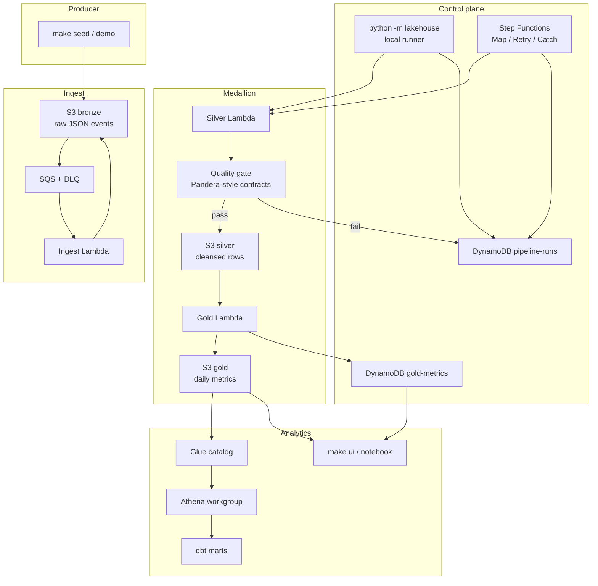

# data-lakehouse-ministack

**A production-shaped medallion lakehouse you can run on a laptop.**

Bronze → Silver → Gold on [MiniStack](https://github.com/ministackorg/ministack)
(`http://localhost:4566`). Same Terraform and Python point at real AWS when
you are ready. No cloud bill for the local loop.

```bash
python -m pip install -e ".[dev]"
make up && make infra
make demo          # seed → quality → gold → assert
```

`make demo` either walks live MiniStack or falls back to an in-memory path
so the showcase still works when Docker is down. Details:
[`docs/demo.md`](docs/demo.md).

## Why this exists

Most “lakehouse on AWS” samples assume a real account, skip contracts, and
hide quality behind a notebook cell. This repo is the opposite:

| You get | Instead of |
| --- | --- |
| Zone contracts in `configs/contracts/` | Informal JSON blobs |
| An explicit quality gate that can fail the run | “trust the transform” |
| Run metadata in DynamoDB (`run_id`, status, metrics) | CloudWatch tail only |
| Terraform against MiniStack **and** AWS | Two divergent stacks |
| Hermetic unit tests + a MiniStack CI job | “works on my machine” |

It is a portfolio-grade control plane for a small event stream: ingest,
cleanse, quarantine, aggregate, catalog, query.

## Architecture



**Two ways to drive the same zones**

1. **Local runner (default):** `make pipeline` / `make demo` — fastest inner loop.
2. **Step Functions:** `make sfn` — production-shaped Map / Retry / Catch
   ([ADR-003](docs/adr/003-local-orchestration-vs-step-functions.md)).

Static copy of the diagram: [`docs/architecture.svg`](docs/architecture.svg).

### Demo walkthrough (what `make demo` prints)

```text
$ make demo
{"mode": "live", "seeded": 20, "silver_valid": 18,
 "quality": "passed", "gold_events": 18,
 "assertions": {"ok": true, "failures": []}}
```

Offline (no Docker):

```bash
python -m lakehouse demo --mode offline --count 20
```

## Status

Phases 0–4 and the Phase 5 demo path are in place. Remaining work is
showcase polish (CONTRIBUTING), security scanning, and an optional Kinesis
path. Live checklist: [`TODO.md`](TODO.md).

| Area | Status | Notes |
| --- | --- | --- |
| Package + MiniStack + Terraform | Done | `make up` / `make infra` |
| Seed / pipeline / query CLI | Done | `python -m lakehouse` |
| Event-driven Bronze + Silver/Gold Lambdas | Done | S3 → SQS → handlers |
| Quality gate + run metadata | Done | fail / quarantine + DynamoDB |
| Step Functions + DLQ + idempotency | Done | [`docs/sfn.md`](docs/sfn.md) |
| Glue + Athena + dbt + query UI | Done | [`docs/catalog.md`](docs/catalog.md), [`docs/dbt.md`](docs/dbt.md), [`docs/query-ui.md`](docs/query-ui.md) |
| Multi-env + cost notes + metrics | Done | [`docs/environments.md`](docs/environments.md) |
| CI + pre-commit | Done | [`.github/workflows/ci.yml`](.github/workflows/ci.yml) |
| One-command demo | Done | `make demo` · [`docs/demo.md`](docs/demo.md) |
| README showcase polish | Done | this file |
| CONTRIBUTING / CODEOWNERS | Later | Phase 5 |
| Security scanning | Later | Checkov / Trivy / detect-secrets |
| Optional streaming (Kinesis) | Later | Phase 5 P2 |

## Prerequisites

- Python 3.11+
- Docker (Compose v2)
- Terraform >= 1.5
- Make + bash

No AWS account for the local loop. `.env.example` uses MiniStack dummy
credentials (`test` / `test`).

## Exact local run

From a fresh clone:

```bash
git clone https://github.com/nuwanda94/data-lakehouse-ministack.git
cd data-lakehouse-ministack

python -m pip install -e ".[dev]"   # or: make install
cp .env.example .env                # optional
pre-commit install                  # optional; same hooks as CI

make up          # MiniStack on :4566
make infra       # S3 + DynamoDB (+ optional Glue/Athena flags)
make demo        # seed → pipeline → query → assertions
make query       # gold + metrics JSON
make ui          # write build/query-ui.html
make test        # hermetic unit tests (no Docker)
```

Step-by-step (same path, more control):

```bash
make outputs     # KEY=value from terraform / defaults
make seed        # synthetic events → bronze
make pipeline    # bronze → silver → quality → gold
make query
make test-integration   # live MiniStack marker
make pre-commit
```

Tear down:

```bash
make destroy     # terraform destroy; MiniStack keeps running
make down        # stop MiniStack
make clean       # down + delete local terraform state
```

### Make targets

| Target | What it runs |
| --- | --- |
| `make install` | `pip install -e ".[dev]"` |
| `make up` / `make health` | Compose + wait + `lakehouse health` |
| `make infra` | `terraform init/apply` in `infra/terraform` |
| `make outputs` | `scripts/get_outputs.sh` |
| `make seed` / `pipeline` / `query` | eval outputs, then the matching CLI |
| `make demo` | live MiniStack demo with assertions |
| `make ingest` / `silver` / `quality` / `gold` | individual zone steps |
| `make sfn` / `make sfn-def` | Step Functions runner / definition dump |
| `make catalog` / `make dbt` / `make ui` | Glue view, dbt parse, HTML snapshot |
| `make reprocess` | rebuild Gold for `LOOKBACK_DAYS` |
| `make test` | `pytest -m "not integration"` |
| `make test-integration` | live Bronze → Silver → Gold |
| `make lint` / `make pre-commit` | ruff + hook suite |
| `make ci` | lint + unit + MiniStack loop (mirrors GHA) |

`make seed` / `pipeline` / `query` / `demo` **eval** `scripts/get_outputs.sh`
so bucket and table names stay aligned with Terraform. Process environment
wins over `.env`.

Equivalent Python (no Make):

```bash
export AWS_ENDPOINT_URL=http://localhost:4566
export AWS_ACCESS_KEY_ID=test AWS_SECRET_ACCESS_KEY=test
export AWS_DEFAULT_REGION=us-east-1 AWS_EC2_METADATA_DISABLED=true

eval "$(python -m lakehouse outputs --export)"
python -m lakehouse health
python -m lakehouse demo --mode auto --count 20
python -m lakehouse query
python -m lakehouse settings
```

## CI

GitHub Actions (`.github/workflows/ci.yml`) on every push and PR to `main`:

1. **lint** — ruff + `terraform fmt -check`
2. **pre-commit** — `.pre-commit-config.yaml`
3. **unit** — `make test` (hermetic; no MiniStack)
4. **ministack-pipeline** — `up` → `infra` → `seed` → `pipeline` → `query` → integration tests

Those four job names are the required status checks for `main`. Enable
branch protection with [`docs/ci.md`](docs/ci.md).

Local full path: `make ci` (needs Docker + Terraform).
Hook gate: `make pre-commit`.

## Configuration

`load_settings()` resolves values in this order:

1. Process environment (Makefile / CI / `eval "$(get_outputs.sh)"`)
2. Discovered `.env` (does **not** override existing env vars)
3. Documented defaults matching Terraform variables

| Setting | Default |
| --- | --- |
| `AWS_ENDPOINT_URL` | `http://localhost:4566` |
| `AWS_DEFAULT_REGION` | `us-east-1` |
| `BRONZE_BUCKET` | `lakehouse-local-bronze` |
| `SILVER_BUCKET` | `lakehouse-local-silver` |
| `GOLD_BUCKET` | `lakehouse-local-gold` |
| `PIPELINE_RUNS_TABLE` | `lakehouse-local-pipeline-runs` |
| `GOLD_METRICS_TABLE` | `lakehouse-local-gold-metrics` |
| `LOOKBACK_DAYS` | `2` |

More knobs: [`docs/configuration.md`](docs/configuration.md),
[`docs/environments.md`](docs/environments.md).

## Package layout

```
src/lakehouse/
  config.py          # Settings + load_settings() / load_dotenv()
  aws.py             # boto3 client factory (endpoint-aware)
  cli.py             # python -m lakehouse
  models.py          # shared dataclasses
  contracts.py       # load configs/contracts/*.json
  ops/               # health, seed, pipeline, query, demo, ui, terraform outputs
  seed/              # synthetic Bronze events
  pipeline/          # zone steps + run records
  transforms/        # Bronze → Silver → Gold
  quality/           # quality-gate hooks
infra/terraform/     # S3, DynamoDB, Lambdas, SFN, Glue/Athena flags
transform/dbt/       # Gold marts on Glue/Athena
configs/contracts/   # zone field lists + partition keys
notebooks/           # gold_query.ipynb
scripts/             # wait_healthy.sh, get_outputs.sh, tf_env.sh
.github/workflows/   # MiniStack CI
docs/                # ADRs, runbook, catalog, cost, demo
tests/
```

## Docs map

| Doc | Topic |
| --- | --- |
| [`docs/demo.md`](docs/demo.md) | One-command demo assertions |
| [`docs/runbook.md`](docs/runbook.md) | Reprocess a date / debug a failed run |
| [`docs/data-dictionary.md`](docs/data-dictionary.md) | Zone fields |
| [`docs/analytical-model.md`](docs/analytical-model.md) | Gold grain + KPIs |
| [`docs/catalog.md`](docs/catalog.md) / [`docs/athena.md`](docs/athena.md) | Glue + named queries |
| [`docs/dbt.md`](docs/dbt.md) / [`docs/query-ui.md`](docs/query-ui.md) | Marts + HTML/notebook |
| [`docs/sfn.md`](docs/sfn.md) / [`docs/dlq.md`](docs/dlq.md) | Orchestration + poison path |
| [`docs/cost-performance.md`](docs/cost-performance.md) | Athena scan cap, Lambda size |
| [`docs/adr/README.md`](docs/adr/README.md) | Architecture decisions |
| [`TODO.md`](TODO.md) / [`PROGRESS.md`](PROGRESS.md) | Live checklist + run log |

## Skills demonstrated

Hiring-manager map of what the repo exercises:

| Skill | Where it shows up |
| --- | --- |
| Medallion modeling | Bronze / Silver / Gold buckets and transforms |
| Zone contracts | `configs/contracts/` + data dictionary |
| Data quality | Named gate that can fail or quarantine a run |
| Event-driven ingest | S3 → SQS → ingest Lambda + DLQ redrive |
| Orchestration | Local runner **and** Step Functions (ADR-003) |
| Idempotency / late data | Content hashes, lookback, `make reprocess` |
| Analytics surface | Glue, Athena named queries, dbt, query UI |
| Local-first AWS | MiniStack + endpoint-aware boto3 |
| IaC | Terraform workspaces / tfvars for local vs AWS |
| Operability | Makefile, JSON CLI, run table, runbook |
| Platform hygiene | pytest, pre-commit, GHA vs MiniStack |
| Cost awareness | Athena bytes cap, Lambda right-size notes |

## Cost and performance

MiniStack is free. Real AWS (`ENV=aws`) should stay **under about a
dollar a month** at demo volume. The line that surprises people is
Athena scanning Bronze instead of Gold.

| Control | Default | Why |
| --- | --- |
| Athena bytes-scanned cutoff | 100 MiB / query | Hard cap (~$0.0005/query at $5/TB) |
| Lambda memory / timeout | 256 MB, 60–120 s | Matches JSON + daily Gold grain |
| `FEATURE_EMIT_METRICS` | off | Avoid CloudWatch custom-metric noise locally |
| Glue / Athena Terraform flags | off on MiniStack | Not required for `make infra` |
| Query surface | Gold named queries | Aggregates, not raw events |

Worked examples: [`docs/cost-performance.md`](docs/cost-performance.md).

## Troubleshooting

| Symptom | Likely cause | Fix |
| --- | --- |
| `make up` hangs / health fails | Docker down or :4566 taken | `docker ps`; keep compose port and `AWS_ENDPOINT_URL` in sync |
| `terraform apply` cannot reach AWS | MiniStack not up | `make up` first |
| Seed writes to unexpected bucket | Stale env / missing outputs | `make outputs`; do not export old names in your shell |
| `ModuleNotFoundError: lakehouse` | Package not installed | `make install` |
| Tests pass but pipeline fails | MiniStack / Terraform not applied | Unit tests are offline; live loop needs `up` + `infra` |
| CI ministack job fails at `make up` | Image pull or port bind | Check the “MiniStack logs on failure” step |
| Pipeline `status=failed` / quality_failed | Bad Bronze, gate, or late Gold | [`docs/runbook.md`](docs/runbook.md) |
| Gold under-counts a day | Late-arriving Silver rows | `LOOKBACK_DAYS=0 AS_OF=YYYY-MM-DD make reprocess` |
| Poison events stuck | DLQ after `maxReceiveCount` | `make dlq` then `make redrive` then `make ingest` |
| `make demo` falls back to offline | MiniStack unreachable | `make up && make infra`, or pass `--mode offline` on purpose |

## License

MIT. See [`LICENSE`](LICENSE).
