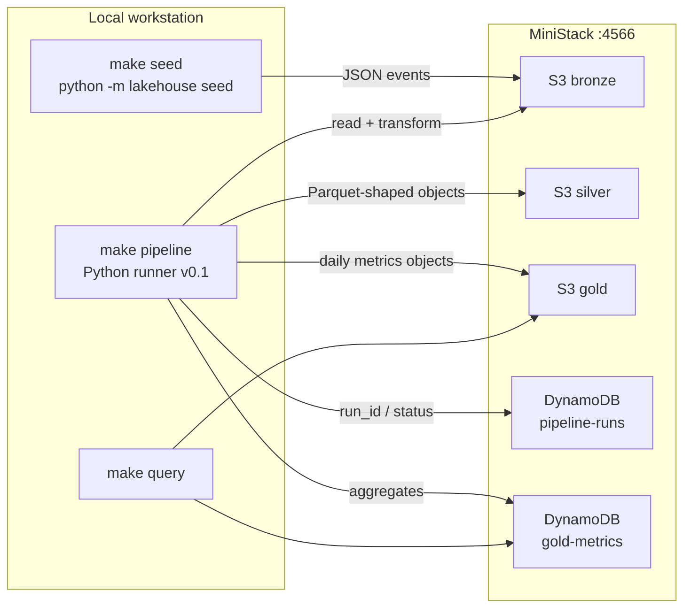

# data-lakehouse-ministack

Local-first **serverless medallion lakehouse** (Bronze → Silver → Gold)
that runs against [MiniStack](https://github.com/ministackorg/ministack)
on `http://localhost:4566`.

The same Terraform and Python code is intended to point at real AWS later.
Today the control plane is a Python runner (`python -m lakehouse`); Phase 2
replaces that with Step Functions. See [ADR-003](docs/adr/003-local-orchestration-vs-step-functions.md).

## Why this exists

- Practice a production-shaped lakehouse **without a cloud bill**.
- Keep zone contracts, quality gates, and run metadata first-class.
- Stay Terraform-native so local MiniStack and AWS stay aligned.

## Architecture



**Current path (Phase 0 / early Phase 1):** seed writes synthetic events to
Bronze; the local runner walks Bronze → Silver → Gold and records a run.

**Target path (Phase 1+):** S3 event → SQS → Lambda per zone, with an
explicit quality gate and DynamoDB run metadata. Orchestration moves to
Step Functions in Phase 2 ([ADR-003](docs/adr/003-local-orchestration-vs-step-functions.md)).

GitHub renders the Mermaid diagram above. A static PNG can be exported from
the same source (`docs/architecture.png`) once an assets export is added.

## Status

| Area | Status | Notes |
| --- | --- | --- |
| Package layout (`src/lakehouse`) | Done | Installable; `python -m lakehouse` |
| MiniStack via Compose | Done | `make up` + health check |
| Terraform core (S3 + DynamoDB) | Done | `make infra` against `:4566` |
| `.env` + Terraform output injection | Done | `scripts/get_outputs.sh`, `lakehouse outputs` |
| Seed / pipeline / query CLI | Done | Local Python runner |
| README + runbook | Done | This file + [`docs/runbook.md`](docs/runbook.md) |
| ADR-003 (runner vs Step Functions) | Done | [docs/adr/003](docs/adr/003-local-orchestration-vs-step-functions.md) |
| Remaining ADRs (001–007) | Done | [docs/adr/README.md](docs/adr/README.md) |
| Unit tests for seed + transform | Done | `tests/test_seed.py`, `tests/test_transforms.py` |
| Event-driven Bronze Lambda | Done | S3 → SQS → ingest handler |
| Silver / Gold Lambdas | Done | handlers + Terraform zip |
| Quality gate | Done | `lakehouse.quality.gate` |
| Bronze → Silver → Gold integration tests | Done | hermetic + live MiniStack marker |
| Zone contracts + data dictionary | Done | [`configs/contracts/`](configs/contracts/) · [`docs/data-dictionary.md`](docs/data-dictionary.md) |
| Full CI vs MiniStack | Done | [`.github/workflows/ci.yml`](.github/workflows/ci.yml) |
| Pre-commit + required checks | Done | [`.pre-commit-config.yaml`](.pre-commit-config.yaml) · [`docs/ci.md`](docs/ci.md) |
| Late-arriving data | Done | [`docs/late-arriving.md`](docs/late-arriving.md) · `make reprocess` |
| Failure injection tests | Done | [`tests/test_failure_injection.py`](tests/test_failure_injection.py) · [`docs/failure-injection.md`](docs/failure-injection.md) |
| Operator runbook | Done | [`docs/runbook.md`](docs/runbook.md) |
| Glue Catalog + Athena named queries | Done | [`docs/catalog.md`](docs/catalog.md) · [`docs/athena.md`](docs/athena.md) |
| Analytical data model | Done | [`docs/analytical-model.md`](docs/analytical-model.md) |
| dbt / query UI | Later | Phase 3 P2 |
| Cost & performance notes | Done | [`docs/cost-performance.md`](docs/cost-performance.md) |

Live checklist: [`TODO.md`](TODO.md). Run log: [`PROGRESS.md`](PROGRESS.md).
ADR index: [`docs/adr/README.md`](docs/adr/README.md).
Zone contracts: [`configs/contracts/`](configs/contracts/).
Analytical model: [`docs/analytical-model.md`](docs/analytical-model.md).
CI / branch protection: [`docs/ci.md`](docs/ci.md).
Ops runbook: [`docs/runbook.md`](docs/runbook.md).

## Prerequisites

- Python 3.11+
- Docker (Compose v2)
- Terraform >= 1.5
- Make + bash

No AWS account is required for the local loop. Credentials in `.env.example`
are dummy values MiniStack accepts (`test` / `test`).

## Exact local run

From a fresh clone:

```bash
git clone https://github.com/nuwanda94/data-lakehouse-ministack.git
cd data-lakehouse-ministack

python -m pip install -e ".[dev]"   # or: make install
cp .env.example .env                # optional; defaults already match Terraform
pre-commit install                  # optional; same hooks CI runs

make up          # MiniStack on :4566, wait until healthy
make infra       # S3 buckets + DynamoDB tables
make outputs     # print KEY=value from terraform output / state / defaults
make seed        # synthetic events → bronze
make pipeline    # bronze → silver → gold (local runner)
make query       # gold object + metrics summary (JSON)
make test        # hermetic unit + zone-path tests
make test-integration  # optional live MiniStack path
make pre-commit  # ruff + terraform fmt + file hygiene
```

Expected shape of a clean run:

1. `make up` prints MiniStack health and lists buckets/tables (empty until infra).
2. `make infra` applies `infra/terraform` and echoes outputs such as
   `BRONZE_BUCKET=lakehouse-local-bronze`.
3. `make seed` prints JSON with the Bronze key and event count (default 50).
4. `make pipeline` prints a `run_id`, zone object keys, and status.
5. `make query` prints Gold + DynamoDB metric rows.
6. `make test` is offline (no MiniStack required). Live zone-path coverage is `make test-integration` after infra.

Tear down:

```bash
make destroy     # terraform destroy; MiniStack keeps running
make down        # stop MiniStack
make clean       # down + delete local terraform state
```

### What each target does

| Target | What it runs |
| --- | --- |
| `make install` | `pip install -e ".[dev]"` |
| `make up` | `docker compose up -d` + `scripts/wait_healthy.sh` + health CLI |
| `make health` | wait script + `python -m lakehouse health` |
| `make infra` | `terraform init/apply` in `infra/terraform` |
| `make outputs` | `scripts/get_outputs.sh` |
| `make seed` | eval outputs, then `python -m lakehouse seed` |
| `make pipeline` | eval outputs, then `python -m lakehouse pipeline` |
| `make reprocess` | rebuild Gold for `LOOKBACK_DAYS` (`docs/late-arriving.md`, `docs/runbook.md`) |
| `make query` | eval outputs, then `python -m lakehouse query` |
| `make test` | `pytest tests -m "not integration"` |
| `make test-integration` | live MiniStack Bronze → Silver → Gold |
| `make lint` | `ruff check` + `ruff format --check` |
| `make pre-commit` | `pre-commit run --all-files` |
| `make ci` | lint + unit + MiniStack loop (same sequence as GHA) |
| `make logs` | MiniStack container logs |

`make seed` / `pipeline` / `query` **eval** `scripts/get_outputs.sh` so bucket
and table names stay in sync with Terraform. Process environment wins over
`.env`; Makefile injection therefore stays authoritative.

Equivalent Python (no Make):

```bash
export AWS_ENDPOINT_URL=http://localhost:4566
export AWS_ACCESS_KEY_ID=test AWS_SECRET_ACCESS_KEY=test
export AWS_DEFAULT_REGION=us-east-1 AWS_EC2_METADATA_DISABLED=true

eval "$(python -m lakehouse outputs --export)"
python -m lakehouse outputs --write-env .env.generated

python -m lakehouse health
python -m lakehouse seed --count 50
python -m lakehouse pipeline
python -m lakehouse query
python -m lakehouse settings
```

## CI

GitHub Actions (`.github/workflows/ci.yml`) on every push and PR to `main`:

1. **lint** — ruff check/format + `terraform fmt -check`
2. **pre-commit** — hooks from `.pre-commit-config.yaml`
3. **unit** — `make test` (hermetic; no MiniStack)
4. **ministack-pipeline** — `make up` → `infra` → `seed` → `pipeline` → `query` → `test-integration`

Those four job names are the required status checks for `main`. How to
enable branch protection (one-time GitHub UI step) is in
[`docs/ci.md`](docs/ci.md).

Local equivalent of the full path: `make ci` (needs Docker + Terraform).
Local equivalent of the hook gate: `make pre-commit` after `pre-commit install`.

## Configuration

`load_settings()` resolves values in this order:

1. Process environment (Makefile / CI / `eval "$(get_outputs.sh)"`)
2. Discovered `.env` (does **not** override existing env vars)
3. Documented defaults matching Terraform variables

| Setting | Default |
| --- | --- |
| `AWS_ENDPOINT_URL` | `http://localhost:4566` |
| `AWS_DEFAULT_REGION` | `us-east-1` |
| `BRONZE_BUCKET` | `lakehouse-local-bronze` |
| `SILVER_BUCKET` | `lakehouse-local-silver` |
| `GOLD_BUCKET` | `lakehouse-local-gold` |
| `PIPELINE_RUNS_TABLE` | `lakehouse-local-pipeline-runs` |
| `GOLD_METRICS_TABLE` | `lakehouse-local-gold-metrics` |
| `LOOKBACK_DAYS` | `2` |

## Package layout

```
src/lakehouse/
  config.py          # Settings + load_settings() / load_dotenv()
  aws.py             # boto3 client factory (endpoint-aware)
  cli.py             # python -m lakehouse
  models.py          # shared dataclasses
  contracts.py       # load configs/contracts/*.json
  ops/               # health, seed, pipeline, query, terraform outputs
  seed/              # synthetic Bronze events
  pipeline/          # zone steps + run records + quality stub
  transforms/        # Bronze → Silver → Gold transforms
  quality/           # quality-gate hooks (Phase 1)
infra/terraform/     # S3 zones + DynamoDB tables against MiniStack
configs/contracts/   # zone field lists + partition keys
scripts/             # wait_healthy.sh, get_outputs.sh, tf_env.sh
.github/workflows/   # MiniStack CI
.pre-commit-config.yaml
docs/adr/            # architecture decision records
docs/ci.md           # required status checks
docs/data-dictionary.md
docs/analytical-model.md
docs/catalog.md
docs/athena.md
docs/partitions.md
docs/late-arriving.md
docs/failure-injection.md
docs/runbook.md      # reprocess a date / debug a failed run
docs/cost-performance.md
docs/environments.md
tests/
```

## Skills demonstrated

Hiring-manager oriented map of what this repo exercises as it matures:

| Skill | Where it shows up |
| --- | --- |
| Medallion modeling | Bronze / Silver / Gold buckets and transforms |
| Zone contracts | `configs/contracts/` + `docs/data-dictionary.md` |
| Analytical model | [`docs/analytical-model.md`](docs/analytical-model.md) — Gold grain + KPIs |
| Local-first AWS | MiniStack + endpoint-aware boto3 |
| IaC | Terraform providers pointed at `:4566` |
| Config discipline | `.env` vs process env vs Terraform outputs |
| Operability | Makefile health checks, CLI JSON, run metadata table, [`docs/runbook.md`](docs/runbook.md) |
| Data quality | Named quality gate (`lakehouse.quality.gate`) |
| Event-driven ingest | S3 → SQS → ingest Lambda |
| Orchestration | Python runner now; Step Functions in Phase 2 ([ADR-003](docs/adr/003-local-orchestration-vs-step-functions.md)) |
| Analytics surface | Glue + Athena named queries; dbt still Phase 3 P2 |
| Platform hygiene | pytest, pre-commit, GitHub Actions vs MiniStack |
| Cost awareness | Athena scan cap, Lambda sizes, [`docs/cost-performance.md`](docs/cost-performance.md) |

## Cost and performance

MiniStack is free. Real AWS (`ENV=aws`) should stay **under about a
dollar a month** at demo volume. The line that can surprise you is
Athena scanning Bronze instead of Gold.

| Control | Default | Why |
| --- | --- | --- |
| Athena bytes-scanned cutoff | 100 MiB / query | Hard cap (~$0.0005/query at $5/TB) |
| Lambda memory / timeout | 256 MB, 60–120 s | Matches current JSON + daily Gold grain |
| `FEATURE_EMIT_METRICS` | off | Avoid CloudWatch custom-metric noise locally |
| Glue / Athena Terraform flags | off on MiniStack | No catalog APIs needed for `make infra` |
| Query surface | Gold named queries | Aggregates, not raw events |

Worked examples, right-sizing notes, and a scale-up sketch:
[`docs/cost-performance.md`](docs/cost-performance.md). Environments:
[`docs/environments.md`](docs/environments.md).

## Troubleshooting

| Symptom | Likely cause | Fix |
| --- | --- | --- |
| `make up` hangs / health fails | Docker not running or port 4566 taken | `docker ps`; change compose port only if you also change `AWS_ENDPOINT_URL` |
| `terraform apply` cannot reach AWS | MiniStack not up | `make up` first; health script is a prerequisite of `make infra` |
| Seed writes to unexpected bucket | Stale env / missing outputs | `make outputs`; avoid exporting old bucket names in your shell |
| `ModuleNotFoundError: lakehouse` | Package not installed | `make install` or `pip install -e ".[dev]"` |
| Tests pass but pipeline fails | MiniStack / Terraform not applied | Unit tests are offline; the live loop needs `up` + `infra` |
| CI ministack job fails at `make up` | Docker image pull or port bind | Check the "MiniStack logs on failure" step |
| `make pre-commit` missing module | Dev extras not installed | `make install` (includes `pre-commit`) |
| Pipeline `status=failed` / quality_failed | Bad Bronze, gate, or late Gold | Follow [`docs/runbook.md`](docs/runbook.md) |
| Gold under-counts a day | Late-arriving Silver rows | `LOOKBACK_DAYS=0 AS_OF=YYYY-MM-DD make reprocess` |
| Poison events stuck | DLQ after `maxReceiveCount` | `make dlq` then `make redrive` then `make ingest` |

## License

MIT. See [`LICENSE`](LICENSE).
