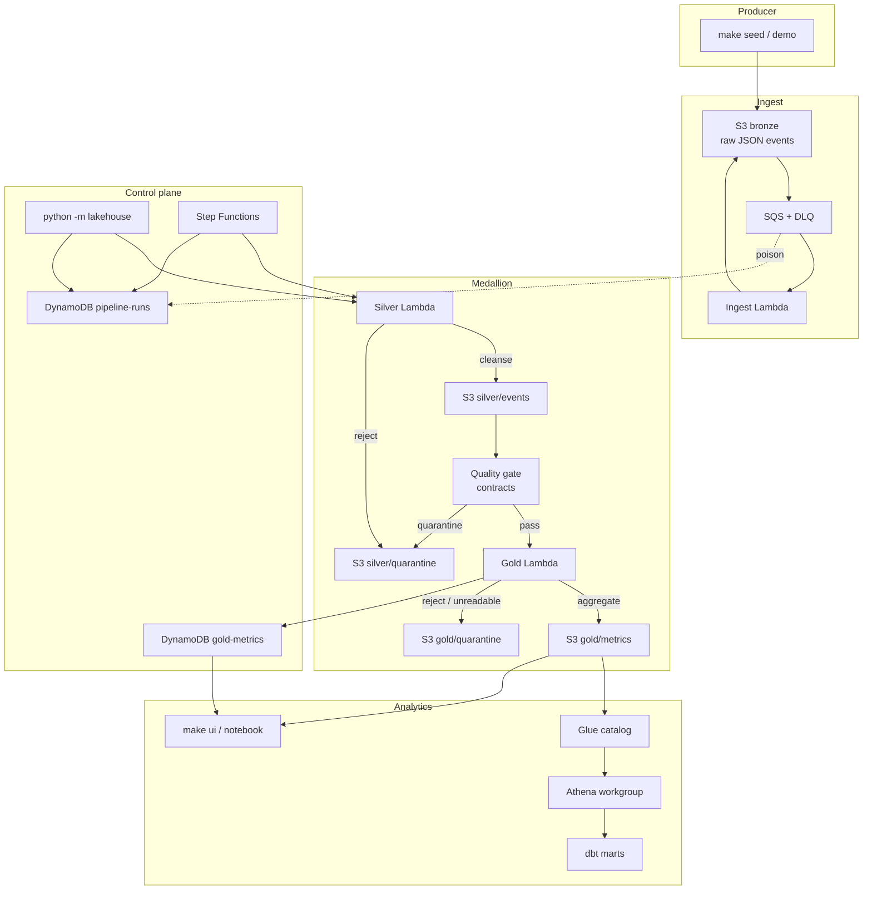

# data-lakehouse-ministack

[](https://github.com/nuwanda94/data-lakehouse-ministack/actions/workflows/ci.yml)
[](https://www.python.org/downloads/)
[](LICENSE)

**A production-shaped medallion lakehouse you can run on a laptop.**

Bronze → Silver → Gold on [MiniStack](https://github.com/ministackorg/ministack)
(`http://localhost:4566`). Same Terraform and Python point at real AWS when
you are ready. No cloud bill for the local loop.

```bash
python -m pip install -e ".[dev]"
make up && make infra
make demo          # seed → quality → gold → assert
```

`make demo` either walks live MiniStack or falls back to an in-memory path
so the showcase still works when Docker is down. Details:
[`docs/demo.md`](docs/demo.md).

**Who this is for.** Data platform and analytics engineers evaluating
local-first lakehouse patterns (contracts, quality gates, orchestration,
catalog) without standing up a real AWS account first.

**Success in 15 minutes.** `make demo` prints `"assertions": {"ok": true}`
and `make query` returns Gold metrics. Offline proof with no Docker:

```bash
python -m lakehouse demo --mode offline --count 20
```

Hiring-manager 15-minute path: [`docs/skills.md`](docs/skills.md).

## Why this exists

Most “lakehouse on AWS” samples assume a real account, skip contracts, and
hide quality behind a notebook cell. This repo is the opposite:

| You get | Instead of |
| --- | --- |
| Zone contracts in `configs/contracts/` | Informal JSON blobs |
| An explicit quality gate that can fail the run or quarantine rows | “trust the transform” |
| Run metadata in DynamoDB (`run_id`, status, metrics) | CloudWatch tail only |
| Terraform against MiniStack **and** AWS | Two divergent stacks |
| Hermetic unit tests + a MiniStack CI job | “works on my machine” |

It is a **reference control plane** for a small commerce event stream:
ingest, cleanse, quarantine, aggregate, catalog, query — not a multi-tenant
SaaS platform or a petabyte Spark cluster.

## Data model

Synthetic **commerce events** (`page_view`, `add_to_cart`, `purchase`,
`refund`). Field lists and types live in
[`configs/contracts/`](configs/contracts/) and
[`docs/data-dictionary.md`](docs/data-dictionary.md).

| Zone | Grain | What lands |
| --- | --- | --- |
| Bronze | 1 raw event (`event_id`) | Immutable JSON under `events/` |
| Silver | 1 cleansed event | Conformed rows under `events/`; rejects under `quarantine/` |
| Quality | 1 report per run | Gate outcome; failing checks can quarantine |
| Gold | 1 (`event_type` × calendar `dt`) | Daily metrics under `metrics/`; bad aggregates under `quarantine/` |

`dt` is the **event occurrence date** from `event_ts`, not the pipeline run
date. Late arrivals keep their original `dt` and set `_late` on Silver so
Gold can reopen that partition (`make reprocess`).

Analytical KPIs and named Athena queries:
[`docs/analytical-model.md`](docs/analytical-model.md).

## Architecture



**Two ways to drive the same zones**

1. **Local runner (default):** `make pipeline` / `make demo` — fastest inner loop.
2. **Step Functions:** `make sfn` — production-shaped Map / Retry / Catch
   ([ADR-003](docs/adr/003-local-orchestration-vs-step-functions.md)).

Lineage (including the combined quarantine subgraph): `make lineage` ·
[`docs/lineage.md`](docs/lineage.md). Static diagram:
[`docs/architecture.svg`](docs/architecture.svg).

### Demo walkthrough

```text
$ make demo
{"mode": "live", "seeded": 20, "silver_valid": 18,
 "quality": "passed", "gold_events": 18,
 "assertions": {"ok": true, "failures": []}}
```

Offline (no Docker):

```bash
python -m lakehouse demo --mode offline --count 20
```

## Guarantees and failure modes

Delivery is **at-least-once** into the zones. Sinks are designed to be
**idempotent** (content hashes / deterministic keys) so retries and SFN
Catch paths do not double-count Gold. That is not a distributed
exactly-once transaction across every store.

| Concern | Behavior |
| --- | --- |
| Retries | Idempotent zone writes; short-circuit when a prior success is recognized |
| Bad Bronze / schema | Silver `quarantine/` side path; cleansed rows still flow when valid |
| Quality failures | Gate can fail the run and/or write quarantine; see quality ADR |
| Bad Gold aggregates | Gold `quarantine/` — never mixed into `metrics/` KPI paths |
| Late data | Keep original `dt`; reopen with `LOOKBACK_DAYS` / `make reprocess` |
| Poison messages | SQS DLQ after `maxReceiveCount` → `make dlq` / `make redrive` |
| Operator debug | DynamoDB `pipeline-runs` (`run_id`, status, metrics, errors) |

Runbook: [`docs/runbook.md`](docs/runbook.md). Idempotency:
[`docs/idempotency.md`](docs/idempotency.md). DLQ: [`docs/dlq.md`](docs/dlq.md).

## Status

**v0.1** (tagged) is a working lakehouse on MiniStack. **HEAD** is
showcase-ready: streaming path, shared storage helpers, lineage, freshness
SLA, retention/compact/maintain across zones and quarantine, security
scanning, and polished docs. Live checklist:
[`TODO.md`](TODO.md) · history: [`CHANGELOG.md`](CHANGELOG.md) ·
[`PROGRESS.md`](PROGRESS.md).

| Area | Status | Notes |
| --- | --- | --- |
| Package + MiniStack + Terraform | Done | `make up` / `make infra` |
| Seed / pipeline / query / demo CLI | Done | `python -m lakehouse` |
| Event-driven Bronze + Silver/Gold Lambdas | Done | S3 → SQS → handlers + DLQ |
| Quality gate + quarantine side paths | Done | Silver + Gold `quarantine/` |
| Run metadata + lineage | Done | DynamoDB runs · `make lineage` |
| Step Functions + idempotency + late data | Done | [`docs/sfn.md`](docs/sfn.md) |
| Glue + Athena + dbt + query UI | Done | [`docs/catalog.md`](docs/catalog.md) |
| Retention / compact / platform-maintain | Done | Bronze → Gold + quarantine |
| Multi-env + cost notes + metrics | Done | [`docs/environments.md`](docs/environments.md) |
| CI + pre-commit + security scan | Done | [`.github/workflows/ci.yml`](.github/workflows/ci.yml) |
| Optional streaming (Kinesis / Firehose) | Done | `make stream` · gated Terraform |
| Release process | Done | [`docs/release.md`](docs/release.md) · [`CHANGELOG.md`](CHANGELOG.md) |

## Prerequisites

- Python 3.11+
- Docker (Compose v2)
- Terraform >= 1.5
- Make + bash

No AWS account for the local loop. `.env.example` uses MiniStack dummy
credentials (`test` / `test`). Security scanning (`make security`,
Checkov / Trivy / hermetic secret scan) is documented in
[`docs/security.md`](docs/security.md); live-looking keys fail CI.

## Exact local run

From a fresh clone:

```bash
git clone https://github.com/nuwanda94/data-lakehouse-ministack.git
cd data-lakehouse-ministack

python -m pip install -e ".[dev]"   # or: make install
cp .env.example .env                # optional
pre-commit install                  # optional; same hooks as CI

make up          # MiniStack on :4566
make infra       # S3 + DynamoDB (+ optional Glue/Athena flags)
make demo        # seed → pipeline → query → assertions
make query       # gold + metrics JSON
make ui          # write build/query-ui.html
make test        # hermetic unit tests (no Docker)
```

Step-by-step (same path, more control):

```bash
make outputs     # KEY=value from terraform / defaults
make seed        # synthetic events → bronze
make pipeline    # bronze → silver → quality → gold
make query
make test-integration   # live MiniStack marker
make pre-commit
```

Tear down:

```bash
make destroy     # terraform destroy; MiniStack keeps running
make down        # stop MiniStack
make clean       # down + delete local terraform state
```

### Core Make targets

| Target | What it runs |
| --- | --- |
| `make install` | `pip install -e ".[dev]"` |
| `make up` / `make health` | Compose + wait + `lakehouse health` |
| `make infra` | `terraform init/apply` in `infra/terraform` |
| `make outputs` | `scripts/get_outputs.sh` |
| `make seed` / `pipeline` / `query` / `demo` | eval outputs, then the matching CLI |
| `make ingest` / `silver` / `quality` / `gold` | individual zone steps |
| `make sfn` / `make sfn-def` | Step Functions runner / definition dump |
| `make catalog` / `make dbt` / `make ui` | Glue view, dbt parse, HTML snapshot |
| `make lineage` / `make sla` | lineage snapshot / Gold freshness |
| `make reprocess` | rebuild Gold for `LOOKBACK_DAYS` |
| `make test` / `make test-integration` | hermetic unit / live MiniStack |
| `make lint` / `make pre-commit` / `make ci` | ruff, hooks, full local CI mirror |
| `make security` | Checkov / Trivy / hermetic secret scan |

Platform ops (retention, compact, maintain across Bronze / Silver / Gold /
quarantine): run `make help` and see
[`docs/platform-maintain.md`](docs/platform-maintain.md).

`make seed` / `pipeline` / `query` / `demo` **eval** `scripts/get_outputs.sh`
so bucket and table names stay aligned with Terraform. Process environment
wins over `.env`.

Equivalent Python (no Make):

```bash
export AWS_ENDPOINT_URL=http://localhost:4566
export AWS_ACCESS_KEY_ID=test AWS_SECRET_ACCESS_KEY=test
export AWS_DEFAULT_REGION=us-east-1 AWS_EC2_METADATA_DISABLED=true

eval "$(python -m lakehouse outputs --export)"
python -m lakehouse health
python -m lakehouse demo --mode auto --count 20
python -m lakehouse query
python -m lakehouse settings
```

## CI

GitHub Actions (`.github/workflows/ci.yml`) on every push and PR to `main`:

1. **lint** — ruff + `terraform fmt -check`
2. **pre-commit** — `.pre-commit-config.yaml`
3. **unit** — `make test` (hermetic; no MiniStack)
4. **ministack-pipeline** — `up` → `infra` → `seed` → `pipeline` → `query` → integration tests
5. **security** — hermetic secret scan + Checkov / Trivy wiring

Those job names are the **recommended** required status checks for `main`.
How to enable branch protection: [`docs/ci.md`](docs/ci.md).

Local full path: `make ci` (needs Docker + Terraform).
Hook gate: `make pre-commit`.

## Configuration

`load_settings()` resolves values in this order:

1. Process environment (Makefile / CI / `eval "$(get_outputs.sh)"`)
2. Discovered `.env` (does **not** override existing env vars)
3. Documented defaults matching Terraform variables

| Setting | Default |
| --- | --- |
| `AWS_ENDPOINT_URL` | `http://localhost:4566` |
| `AWS_DEFAULT_REGION` | `us-east-1` |
| `BRONZE_BUCKET` | `lakehouse-local-bronze` |
| `SILVER_BUCKET` | `lakehouse-local-silver` |
| `GOLD_BUCKET` | `lakehouse-local-gold` |
| `PIPELINE_RUNS_TABLE` | `lakehouse-local-pipeline-runs` |
| `GOLD_METRICS_TABLE` | `lakehouse-local-gold-metrics` |
| `LOOKBACK_DAYS` | `2` |

Quality thresholds, retention TTLs, compact limits, and feature flags live
in [`docs/configuration.md`](docs/configuration.md) and
[`docs/environments.md`](docs/environments.md).

## Capability map

| Area | Where |
| --- | --- |
| Settings / AWS clients | `src/lakehouse/config.py`, `aws.py` |
| CLI | `src/lakehouse/cli.py` · `python -m lakehouse` |
| Ingest / zones | `ingest/`, `silver/`, `gold/`, `quality/` |
| Shared storage helpers | `storage` (shared lib extract) |
| Orchestration | `ops/pipeline.py`, `orchestration/sfn.py` |
| Platform ops | retention / compact / maintain modules |
| Lineage / SLA | `lineage.py`, SLA CLI |
| Analytics | Glue/Athena helpers, `transform/dbt/`, query UI |
| Contracts | `configs/contracts/` |
| IaC | `infra/terraform/` |
| Docs / ADRs | `docs/` |
| Tests / CI | `tests/`, `.github/workflows/` |

## Docs map

| Doc | Topic |
| --- | --- |
| [`docs/demo.md`](docs/demo.md) | One-command demo assertions |
| [`docs/runbook.md`](docs/runbook.md) | Reprocess a date / debug a failed run |
| [`docs/data-dictionary.md`](docs/data-dictionary.md) | Zone fields |
| [`docs/analytical-model.md`](docs/analytical-model.md) | Gold grain + KPIs |
| [`docs/lineage.md`](docs/lineage.md) | Zone graph + quarantine subgraph |
| [`docs/catalog.md`](docs/catalog.md) / [`docs/athena.md`](docs/athena.md) | Glue + named queries |
| [`docs/dbt.md`](docs/dbt.md) / [`docs/query-ui.md`](docs/query-ui.md) | Marts + HTML/notebook |
| [`docs/sfn.md`](docs/sfn.md) / [`docs/dlq.md`](docs/dlq.md) | Orchestration + poison path |
| [`docs/platform-maintain.md`](docs/platform-maintain.md) | Expire-then-compact across zones |
| [`docs/cost-performance.md`](docs/cost-performance.md) | Athena scan cap, Lambda size |
| [`docs/adr/README.md`](docs/adr/README.md) | Architecture decisions |
| [`docs/skills.md`](docs/skills.md) | Hiring-manager skill matrix + 15-minute review path |
| [`docs/security.md`](docs/security.md) | Checkov / Trivy / hermetic secret scan |
| [`docs/release.md`](docs/release.md) | Tagging and CHANGELOG |
| [`CONTRIBUTING.md`](CONTRIBUTING.md) / [`.github/CODEOWNERS`](.github/CODEOWNERS) | How to change the repo |
| [`TODO.md`](TODO.md) / [`PROGRESS.md`](PROGRESS.md) / [`CHANGELOG.md`](CHANGELOG.md) | Checklist, run log, release notes |

## Skills demonstrated

Hiring-manager map of what the repo exercises. Full write-up with a
15-minute review path and role mapping:
[`docs/skills.md`](docs/skills.md).

| Skill | Where it shows up |
| --- | --- |
| Medallion modeling | Bronze / Silver / Gold buckets and transforms |
| Zone contracts + evolution | `configs/contracts/` + `lakehouse.contract_check` |
| Data quality | Named gate that can fail or quarantine a run |
| Event-driven ingest | S3 → SQS → ingest Lambda + DLQ redrive |
| Orchestration | Local runner **and** Step Functions (ADR-003) |
| Idempotency / late data | Content hashes, lookback, `make reprocess` |
| Analytics surface | Glue, Athena named queries, dbt, query UI |
| Platform lifecycle | Retention, compact, `platform-maintain` |
| Lineage | Spec + live graphs including quarantine subgraph |
| Local-first AWS | MiniStack + endpoint-aware boto3 |
| IaC | Terraform workspaces / tfvars for local vs AWS |
| Operability | Makefile, JSON CLI, run table, runbook |
| Platform hygiene | pytest, pre-commit, GHA vs MiniStack, security scan |
| Cost awareness | Athena bytes cap, Lambda right-size notes |

## Cost and performance

MiniStack is free. Real AWS (`ENV=aws`) should stay **under about a
dollar a month** at demo volume. The line that surprises people is
Athena scanning Bronze instead of Gold.

| Control | Default | Why |
| --- | --- | --- |
| Athena bytes-scanned cutoff | 100 MiB / query | Hard cap (~$0.0005/query at $5/TB) |
| Lambda memory / timeout | 256 MB, 60–120 s | Matches JSON + daily Gold grain |
| `FEATURE_EMIT_METRICS` | off | Avoid CloudWatch custom-metric noise locally |
| Glue / Athena Terraform flags | off on MiniStack | Not required for `make infra` |
| Query surface | Gold named queries | Aggregates, not raw events |

Worked examples: [`docs/cost-performance.md`](docs/cost-performance.md).

## Troubleshooting

| Symptom | Likely cause | Fix |
| --- | --- | --- |
| `make up` hangs / health fails | Docker down or :4566 taken | `docker ps`; keep compose port and `AWS_ENDPOINT_URL` in sync |
| `terraform apply` cannot reach AWS | MiniStack not up | `make up` first |
| Seed writes to unexpected bucket | Stale env / missing outputs | `make outputs`; do not export old names in your shell |
| `ModuleNotFoundError: lakehouse` | Package not installed | `make install` |
| Tests pass but pipeline fails | MiniStack / Terraform not applied | Unit tests are offline; live loop needs `up` + `infra` |
| CI ministack job fails at `make up` | Image pull or port bind | Check the “MiniStack logs on failure” step |
| Pipeline `status=failed` / quality_failed | Bad Bronze, gate, or late Gold | [`docs/runbook.md`](docs/runbook.md) |
| Gold under-counts a day | Late-arriving Silver rows | `LOOKBACK_DAYS=0 AS_OF=YYYY-MM-DD make reprocess` |
| Poison events stuck | DLQ after `maxReceiveCount` | `make dlq` then `make redrive` then `make ingest` |
| `make demo` falls back to offline | MiniStack unreachable | `make up && make infra`, or pass `--mode offline` on purpose |

## License

MIT. See [`LICENSE`](LICENSE).
