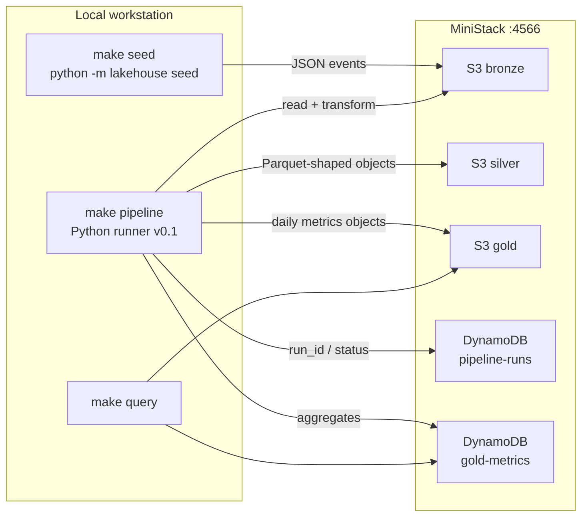

# data-lakehouse-ministack

Local-first **serverless medallion lakehouse** (Bronze → Silver → Gold)
that runs against [MiniStack](https://github.com/ministackorg/ministack)
on `http://localhost:4566`.

The same Terraform and Python code is intended to point at real AWS later.
Today the control plane is a Python runner (`python -m lakehouse`); Phase 2
replaces that with Step Functions. See
[ADR-003](docs/adr/0003-local-orchestration-vs-step-functions.md).

## Why this exists

- Practice a production-shaped lakehouse **without a cloud bill**.
- Keep zone contracts, quality gates, and run metadata first-class.
- Stay Terraform-native so local MiniStack and AWS stay aligned.

## Architecture



**Current path (Phase 0 / early Phase 1):** seed writes synthetic events to
Bronze; the local runner walks Bronze → Silver → Gold and records a run.

**Target path (Phase 1+):** S3 event → SQS → Lambda per zone, with an
explicit quality gate and DynamoDB run metadata. Orchestration moves to
Step Functions in Phase 2
([ADR-003](docs/adr/0003-local-orchestration-vs-step-functions.md)).

GitHub renders the Mermaid diagram above. A static PNG can be exported from
the same source (`docs/architecture.png`) once an assets folder lands.

## Status

| Area | Status | Notes |
| --- | --- | --- |
| Package layout (`src/lakehouse`) | Done | Installable; `python -m lakehouse` |
| MiniStack via Compose | Done | `make up` + health check |
| Terraform core (S3 + DynamoDB) | Done | `make infra` against `:4566` |
| `.env` + Terraform output injection | Done | `scripts/get_outputs.sh`, `lakehouse outputs` |
| Seed / pipeline / query CLI | Done | Local Python runner |
| README + runbook | Done | This file |
| ADR-003 (runner vs Step Functions) | Done | [`docs/adr/0003-...`](docs/adr/0003-local-orchestration-vs-step-functions.md) |
| Unit tests for seed + transform | Open | Phase 0 test |
| Event-driven Bronze Lambda | Open | Phase 1 P0 |
| Silver / Gold Lambdas | Open | Phase 1 P0 |
| Quality gate (Pandera / GE) | Open | Phase 1 P0 |
| Glue / Athena / dbt | Later | Phase 3 |

Live checklist: [`TODO.md`](TODO.md). Run log: [`PROGRESS.md`](PROGRESS.md).

## Prerequisites

- Python 3.11+
- Docker (Compose v2)
- Terraform >= 1.5
- Make + bash

No AWS account is required for the local loop. Credentials in `.env.example`
are dummy values MiniStack accepts (`test` / `test`).

## Exact local run

From a fresh clone:

```bash
git clone https://github.com/nuwanda94/data-lakehouse-ministack.git
cd data-lakehouse-ministack

python -m pip install -e ".[dev]"   # or: make install
cp .env.example .env                # optional; defaults already match Terraform

make up          # MiniStack on :4566, wait until healthy
make infra       # S3 buckets + DynamoDB tables
make outputs     # print KEY=value from terraform output / state / defaults
make seed        # synthetic events → bronze
make pipeline    # bronze → silver → gold (local runner)
make query       # gold object + metrics summary (JSON)
make test        # unit tests
```

Expected shape of a clean run:

1. `make up` prints MiniStack health and lists buckets/tables (empty until infra).
2. `make infra` applies `infra/terraform` and echoes outputs such as
   `BRONZE_BUCKET=lakehouse-local-bronze`.
3. `make seed` prints JSON with the Bronze key and event count (default 50).
4. `make pipeline` prints a `run_id`, zone object keys, and status.
5. `make query` prints Gold + DynamoDB metric rows.
6. `make test` is offline (no MiniStack required).

Tear down:

```bash
make destroy     # terraform destroy; MiniStack keeps running
make down        # stop MiniStack
make clean       # down + delete local terraform state
```

### What each target does

| Target | What it runs |
| --- | --- |
| `make install` | `pip install -e ".[dev]"` |
| `make up` | `docker compose up -d` + `scripts/wait_healthy.sh` + health CLI |
| `make health` | wait script + `python -m lakehouse health` |
| `make infra` | `terraform init/apply` in `infra/terraform` |
| `make outputs` | `scripts/get_outputs.sh` |
| `make seed` | eval outputs, then `python -m lakehouse seed` |
| `make pipeline` | eval outputs, then `python -m lakehouse pipeline` |
| `make query` | eval outputs, then `python -m lakehouse query` |
| `make test` | `pytest tests` |
| `make logs` | MiniStack container logs |

`make seed` / `pipeline` / `query` **eval** `scripts/get_outputs.sh` so bucket
and table names stay in sync with Terraform. Process environment wins over
`.env`; Makefile injection therefore stays authoritative.

Equivalent Python (no Make):

```bash
export AWS_ENDPOINT_URL=http://localhost:4566
export AWS_ACCESS_KEY_ID=test AWS_SECRET_ACCESS_KEY=test
export AWS_DEFAULT_REGION=us-east-1 AWS_EC2_METADATA_DISABLED=true

eval "$(python -m lakehouse outputs --export)"
python -m lakehouse outputs --write-env .env.generated

python -m lakehouse health
python -m lakehouse seed --count 50
python -m lakehouse pipeline
python -m lakehouse query
python -m lakehouse settings
```

## Configuration

`load_settings()` resolves values in this order:

1. Process environment (Makefile / CI / `eval "$(get_outputs.sh)"`)
2. Discovered `.env` (does **not** override existing env vars)
3. Documented defaults matching Terraform variables

| Setting | Default |
| --- | --- |
| `AWS_ENDPOINT_URL` | `http://localhost:4566` |
| `AWS_DEFAULT_REGION` | `us-east-1` |
| `BRONZE_BUCKET` | `lakehouse-local-bronze` |
| `SILVER_BUCKET` | `lakehouse-local-silver` |
| `GOLD_BUCKET` | `lakehouse-local-gold` |
| `PIPELINE_RUNS_TABLE` | `lakehouse-local-pipeline-runs` |
| `GOLD_METRICS_TABLE` | `lakehouse-local-gold-metrics` |

## Package layout

```
src/lakehouse/
  config.py          # Settings + load_settings() / load_dotenv()
  aws.py             # boto3 client factory (endpoint-aware)
  cli.py             # python -m lakehouse
  models.py          # shared dataclasses
  ops/               # health, seed, pipeline, query, terraform outputs
  seed/              # synthetic Bronze events
  pipeline/          # zone steps + run records + quality stub
  transforms/        # Bronze → Silver → Gold transforms
  quality/           # quality-gate hooks (Phase 1)
infra/terraform/     # S3 zones + DynamoDB tables against MiniStack
scripts/             # wait_healthy.sh, get_outputs.sh, tf_env.sh
docs/adr/            # architecture decision records
tests/
```

## Skills demonstrated

Hiring-manager oriented map of what this repo exercises as it matures:

| Skill | Where it shows up |
| --- | --- |
| Medallion modeling | Bronze / Silver / Gold buckets and transforms |
| Local-first AWS | MiniStack + endpoint-aware boto3 |
| IaC | Terraform providers pointed at `:4566` |
| Config discipline | `.env` vs process env vs Terraform outputs |
| Operability | Makefile health checks, CLI JSON, run metadata table |
| Data quality | Planned Pandera / Great Expectations gate |
| Event-driven ingest | Planned S3 → SQS → Lambda |
| Orchestration | Python runner now; Step Functions in Phase 2 ([ADR-003](docs/adr/0003-local-orchestration-vs-step-functions.md)) |
| Analytics surface | Planned Glue Catalog + Athena + optional dbt |
| Platform hygiene | pytest, pre-commit, conventional commits |

## Troubleshooting

| Symptom | Likely cause | Fix |
| --- | --- |
| `make up` hangs / health fails | Docker not running or port 4566 taken | `docker ps`; change compose port only if you also change `AWS_ENDPOINT_URL` |
| `terraform apply` cannot reach AWS | MiniStack not up | `make up` first; health script is a prerequisite of `make infra` |
| Seed writes to unexpected bucket | Stale env / missing outputs | `make outputs`; avoid exporting old bucket names in your shell |
| `ModuleNotFoundError: lakehouse` | Package not installed | `make install` or `pip install -e ".[dev]"` |
| Tests pass but pipeline fails | MiniStack / Terraform not applied | Unit tests are offline; the live loop needs `up` + `infra` |

## License

MIT. See [`LICENSE`](LICENSE).
